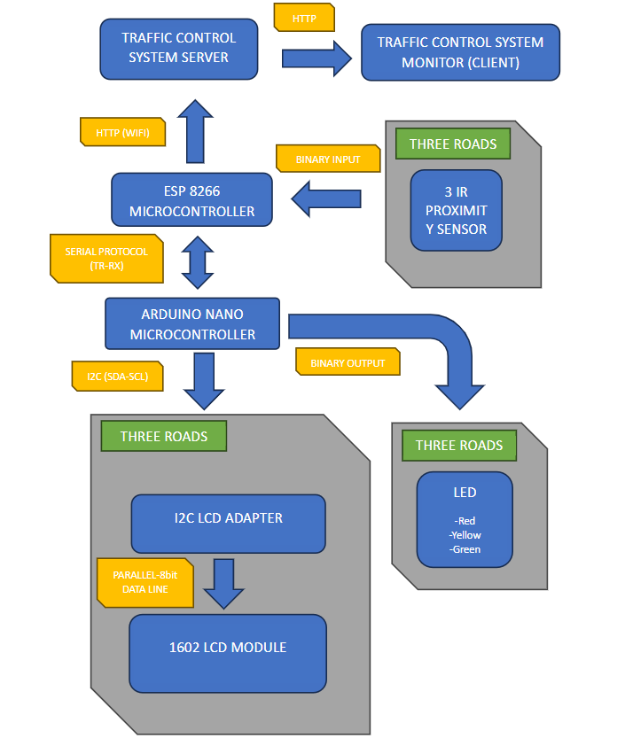

# Distributed Traffic Control System

## Project Overview
The **Distributed Traffic Control System** is an IoT-based solution for managing and monitoring traffic at multi-road intersections. It integrates embedded hardware for real-time control with a Django-based web server for remote observability and data analytics. This project was done as a mini demonstration which could be scaled with computer vision for density tracking.

## Demo
The project was done in 200L second semester, I was able to get a video I made from my google cloud to post on youtube (PS the video was poorly made 😂)

[](https://www.youtube.com/watch?v=jsNf7KCeVmA)
https://www.youtube.com/watch?v=jsNf7KCeVmA


## System Architecture
I designed the system as a distributed architecture dividing responsibilities between field hardware and a central cloud server.




### 1. Web Monitor (Server Layer)
*   **Technology:** Django (Python), HTML, CSS, JavaScript (jQuery).
*   **Host:** PythonAnywhere (`tcsmonitor.pythonanywhere.com`).
*   **Function:**
    *   Receives real-time telemetry from the intersection.
    *   Displays traffic light states, road density, and vehicle counts.
    *   Provides an interface for manual overrides (maintenance/emergency).

### 2. Intersection Gateway & Sensor Node (ESP8266)
*   **Hardware:** ESP8266 NodeMCU.
*   **Firmware:** C++ (Arduino Framework) located in `esp8266_firmware`.
*   **Responsibilities:**
    *   **Connectivity:** Connects to Wi-Fi and synchronizes time via NTP.
    *   **Sensor Fusion:** Directly reads IR sensors on 3 roads to calculate traffic density and vehicle counts.
    *   **Data Aggregation:** Receives current traffic light states from the Field Controller via Serial.
    *   **Communication:** Pushes aggregated data (States, Densities, Counts) to the Web Server via HTTP GET requests. Sends calculated density data to the Field Controller.

### 3. Field Controller (Arduino Nano)
*   **Hardware:** Arduino Nano (Connected via Serial).
*   **Firmware:** C++ (Arduino Framework) located in `nano_firmware`.
*   **Responsibilities:**
    *   Directly drives the Traffic Light LEDs (Red, Yellow, Green).
    *   Manages the state machine for traffic sequencing.
    *   Updates the 1602 LCD Status Display.
    *   Adjusts timing based on density data received from the ESP8266.

## Directory Structure

```text
traffic_control_system/
├── traffic_control_server/      # Django Web Application
│   ├── app/                     # Core Application Logic
│   ├── traffic_control_server/  # Project Configuration (Settings, URLs)
│   ├── static/                  # Static Assets
│   │   └── admin/js/vendor/     # Dependencies (jQuery, Select2, XRegExp)
│   └── manage.py                # Django Management Script
├── esp8266_firmware/               # ESP8266 Gateway Firmware
│   └── esp8266_firmware.ino        # Logic for Wi-Fi, IR Sensors, and HTTP
├── nano_firmware/               # Arduino Nano Controller Firmware
│   └── nano_firmware.ino        # Logic for LED driving, LCDs, and Timing
└── README.md                    # Project Documentation
```
